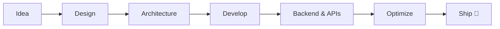

<!-- Animated header banner -->

<!-- Typing tagline -->

 

---

## ✦ About

**Full-Stack Developer from India** — I ship production-ready products across the full lifecycle: *UI/UX → frontend → APIs → backend → integrations → deployment*.

`SaaS Platforms` `CRM Systems` `TravelTech` `Shopify Stores` `Headless Commerce` `Dashboards` `3D / WebGL` `PWAs`

---

## 🛠️ Tech Stack

<table>
<tr>
  <td width="33%" valign="top">

**🎨 Frontend**

`React` · `Next.js` · `TypeScript` · `Tailwind`

**✨ UI · Motion**

`shadcn/ui` · `Framer Motion` · `GSAP`

  </td>
  <td width="34%" valign="top">

**⚙️ Backend**

`REST` · `GraphQL` · `MongoDB` · `Auth`

**🧪 Creative Dev**

`Three.js` · `React Three Fiber` · `Canvas` · `WebGL`

  </td>
  <td width="33%" valign="top">

**🛒 Shopify & Commerce**

`Liquid` · `Storefront API` · `Headless`

**🛒 What I build with Shopify**

`Themes` · `Sections` · `APIs` · `Storefronts`

  </td>
</tr>
</table>

---

## 🛒 Shopify & Headless Commerce

<table>
<tr>
<td width="50%">

**Native Shopify**

- 🎨 Custom themes & Liquid sections
- 🏪 Product, collection & landing pages
- 🔌 Admin API & third-party integrations
- ⚡ Performance-focused storefronts

</td>
<td width="50%">

**Headless Architecture**

- 🚀 Shopify Storefront API (GraphQL)
- ⚛️ Next.js + React storefronts
- 🧩 Custom product & cart experiences
- 📡 Fully API-driven commerce

</td>
</tr>
</table>

---

## ✈️ TravelTech & CRM

End-to-end travel operations platforms — complex workflows turned into simple interfaces:

`Accommodation` · `Itineraries` · `Trip Calendars` · `PAX Management` · `Quotations` · `Packages` · `Bookings` · `Transfers` · `Activities` · `Consultant Workflows` · `Ops Dashboards`

**Stack:** `Next.js` · `TypeScript` · `Node.js` · `REST / GraphQL` · `MongoDB`

---

## ⚡ What I Build

| 🌐 Web Apps | 🚀 SaaS | 🧩 CRM | ✈️ TravelTech |
|---|---|---|---|
| 🛒 Shopify / Headless | 📊 Dashboards | 🏢 Business Sites | ✨ Interactive UI |
| 🌐 3D / WebGL | 📱 PWAs | 🔌 API Integrations | 🎨 Design Systems |

---

## 🏗️ How I Build

**Product Thinking × Design × Engineering** — fast ⚡ · responsive 📱 · accessible ♿ · scalable 📈

---

## 📊 GitHub Activity

<table>
<tr>
<td>
  
</td>
<td>
  
</td>
</tr>
</table>

---

## 🤝 Let's Build Something

 

