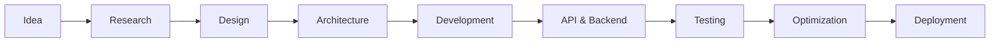

<div align="center">

# 👋 Hi, I'm **Rohit Kumar Mishra**

### Full-Stack Developer · Frontend Engineer · Shopify & Headless Commerce

**I build modern web products, SaaS platforms, CRMs, TravelTech products, e-commerce experiences, and interactive web applications.**

<br />

`Frontend` · `Backend` · `Full-Stack` · `SaaS` · `CRM`
`TravelTech` · `Shopify` · `Headless Commerce` · `Next.js` · `UI/UX`

<br /><br />

<a href="https://rohit-mishra954.vercel.app/">
  
</a>
<a href="https://www.linkedin.com/in/rohit-mishra954">
  
</a>
<a href="mailto:rohitkumarmishra954@gmail.com">
  
</a>

<br /><br />


</div>

---

## ✦ About Me

I'm a **Full-Stack Developer from India** focused on building polished, scalable, and production-ready digital products.

I work across the entire development lifecycle — from **UI/UX and frontend architecture to APIs, backend systems, databases, integrations, and deployment**.

My work includes **Travel CRM platforms, SaaS products, business dashboards, e-commerce websites, Shopify stores, headless commerce applications, landing pages, and interactive web experiences.**

I enjoy working at the intersection of:

**Design × Engineering × Product**

### What I enjoy building

* ⚡ Modern React & Next.js applications
* 🧩 SaaS platforms & business tools
* ✈️ Travel CRM & TravelTech products
* 🛒 Shopify & headless commerce
* 📊 Dashboards & operational systems
* 🔌 REST & GraphQL API integrations
* 🎨 Design systems & reusable UI
* ✨ Motion-driven & interactive interfaces
* 🌐 3D / WebGL experiences
* 📱 Responsive & PWA applications

---

# 🛠️ Tech Stack

## Frontend

<p>
  
</p>

**Core:**
`HTML` · `CSS` · `JavaScript` · `TypeScript` · `React` · `Next.js` · `Tailwind CSS` · `Sass`

---

## 🎨 UI · Design · Motion

<p>
  
</p>

`shadcn/ui` · `Material UI` · `Chakra UI` · `Figma`
`Framer Motion` · `GSAP`

---

## ⚙️ Backend · APIs · Database

<p>
  
</p>

**Backend:** `Node.js` · `Express.js`

**APIs:** `REST` · `GraphQL` · `Third-party API Integrations`

**Database:** `MongoDB`

**Application:** `Authentication` · `CRUD` · `Business Logic` · `API Architecture`

---

## 🛒 Shopify · E-Commerce · Headless

I build modern commerce experiences using both **Shopify's native ecosystem and headless architectures**.

### Shopify

* Shopify storefront development
* Custom themes & sections
* Liquid customization
* Product & collection experiences
* Custom landing pages
* Shopify API integrations
* Third-party integrations
* Responsive storefronts
* Performance-focused UI

### Headless Commerce

* Shopify Headless
* Shopify Storefront API
* GraphQL
* Next.js + Shopify
* React-based storefronts
* Custom product experiences
* Custom collection experiences
* API-driven commerce
* Headless storefront architecture

**Commerce Stack**

`Shopify` · `Liquid` · `Storefront API` · `GraphQL`
`React` · `Next.js` · `TypeScript` · `Tailwind CSS`

---

## ✈️ TravelTech · Travel CRM

One of the areas I work on is **travel technology and CRM platforms**.

I build interfaces and workflows around real-world travel operations, including:

* 🏨 Accommodation management
* ✈️ Trip & itinerary management
* 📅 Trip calendars
* 👥 Traveller / PAX management
* 📋 Quotations
* 💰 Packages & pricing
* 🧾 Booking workflows
* 🚐 Transfers
* 🎯 Activities
* 👨‍💼 Travel consultant workflows
* 📊 Operations dashboards
* 🔗 Shareable quotation pages

### Travel CRM Architecture

```text
                    TRAVEL CRM
                        │
        ┌───────────────┴───────────────┐
        │                               │
     FRONTEND                         BACKEND
        │                               │
 React / Next.js                  APIs / Business Logic
        │                               │
 UI / Dashboards                    Database
        │                               │
 Workflows                         Integrations
        │                               │
        └───────────────┬───────────────┘
                        │
                   DEPLOYMENT
```

The goal is to turn complex travel operations into **simple, intuitive, and efficient interfaces**.

---

# ⚡ What I Build

```text
┌────────────────────────────────────────────────────────┐
│                                                        │
│  🌐 Web Applications       🚀 SaaS Platforms            │
│                                                        │
│  🧩 CRM Systems            ✈️ TravelTech                │
│                                                        │
│  🛒 Shopify Stores         🔗 Headless Commerce         │
│                                                        │
│  📊 Dashboards             🏢 Business Websites         │
│                                                        │
│  ✨ Interactive UI         🌐 3D / WebGL Experiences    │
│                                                        │
│  📱 PWAs                   🎨 Design Systems             │
│                                                        │
└────────────────────────────────────────────────────────┘
```

---

# 🎯 Development Focus

I care about building products that are not only visually polished, but also:

* ⚡ **Fast**
* 📱 **Responsive**
* ♿ **Accessible**
* 🧩 **Maintainable**
* 🔒 **Reliable**
* 📈 **Scalable**
* 🎨 **Consistent**
* ✨ **Interactive**

> **Good UI isn't just about looking beautiful — it should feel effortless to use.**

---

# 🧪 Creative Development

I enjoy experimenting with modern web technologies to create unique digital experiences.

### Exploring

`Framer Motion` · `GSAP` · `Three.js` · `React Three Fiber`

`Canvas API` · `Fabric.js` · `WebGL`

### Things I build

* Interactive hero sections
* Scroll-based animations
* Micro-interactions
* 3D interfaces
* Canvas experiences
* Experimental navigation
* Motion-driven landing pages
* Creative UI concepts

---

# 🏗️ How I Build



My approach combines:

**Product Thinking × Design × Engineering**

---

# 🚀 Featured Work

## ✈️ Travel CRM

A travel operations platform focused on managing trips, travellers, accommodations, quotations, bookings, transfers, activities, and operational workflows.

**Focus:**
`TravelTech` · `CRM` · `Operations` · `Dashboards` · `Quotations`

**Stack:**
`Next.js` · `React` · `TypeScript` · `Tailwind CSS` · `Node.js` · `APIs`

---

## 🛒 Shopify & Headless Commerce

Modern e-commerce experiences built around:

`Shopify` · `Liquid` · `Storefront API` · `GraphQL` · `Next.js` · `React`

Focused on **custom storefronts, responsive experiences, performance, and scalable commerce architecture.**

---

## 🌐 Business & SaaS Applications

I build websites and applications for:

* Startups
* SaaS products
* Agencies
* Travel companies
* E-commerce brands
* Education platforms
* Business services
* Personal brands

---

# 📊 GitHub Activity

<div align="center">


</div>

<br />

<div align="center">


</div>

---

# 📈 Contributions

<div align="center">


</div>

---

# 🤝 Let's Build Something

I'm always interested in building interesting products, solving challenging problems, and exploring new ideas.

Whether it's a **SaaS platform, CRM, TravelTech product, Shopify store, headless commerce application, business website, dashboard, or interactive experience** — I enjoy turning ideas into working products.

<br />

<div align="center">

<a href="https://rohit-mishra954.vercel.app/">
  
</a>

<a href="https://www.linkedin.com/in/rohit-mishra954">
  
</a>

<a href="mailto:rohitkumarmishra954@gmail.com">
  
</a>

<br /><br />

### ⚡ Build · Ship · Learn · Repeat

</div>
